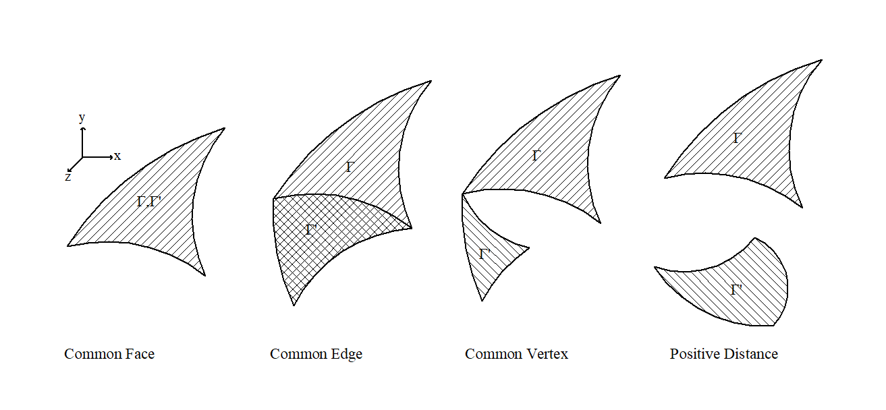

# Non-Parameterized

The called function in this implementation looks like:

`sauterschwabintegral(sourcechart, testchart, integrand, accuracy)`.

`sourcechart` and `testchart` are the mappings from a reference triangle (parametrisation) to the real triangles in space, they contain the information of the positions of both triangles. The two charts can be created by

`testchart = simplex(P1,P2,P3); sourcechart = simplex(P4,P5,P6)`.

The order of the input arguments within `simplex()` does not matter.

`simplex()` creates the mapping and needs input arguments of type `SVector{3,Float64}`; the points P1 to P6 can be created by

`P = point(x,y,z)`.

`x`, `y` and `z` are the coordinates of that particular point and `point()` creates a position vector which is of type `SVector{3,Float64}`.

The `integrand` must be defined as a function with two input arguments; the input arguments must be 3D (physical)  vectors. The function name is the input argument.

The two area-integrals are transformed to four 1D integrals from zero to one; `accuracy` gives the number of quadrature points on that integration path, therefore `accuracy` is of type unsigned Int64.

Since `simplex()` and `point()` are functions of 'CompScienceMeshes', CompScienceMeshes does not just have to be installed on the user's machine, but also be available in the current workspace, the same applies for this package as well. The two packages can be made available by

`using SauterSchwabQuadrature` and `using CompScienceMeshes`.

Those two commands must always be run at the beginning if using this type of implementation.

`sauterschwabintegral()` first modifies `testchart` and `sourcechart` with respect to the order of the arguments within their `simplex()` functions; and secondly -- depending on how many vertices both charts have in common -- it generates an object of some type, which contains the information of the accuracy, and the integration strategy. After all of that have been done, this function will call another function with input arguments of the two modified charts, the integrand, and that new object.

To understand the examples stored in the example folder, the 'another called function' will be presented next:

## Integration

According to item 1 on the homepage, four different constellations of the two triangles are possible:
* Equal triangles $\to$ Common Face
* Two vertices in common $\to$ Common Edge
* One vertex in common $\to$ Common Vertex
* Both triangles do not touch at all $\to$ Positive Distance

As each of those four constellations has its own integration method (because of a possible singularity in the kernel), the function `sauterschwabintegral()` has to call another function, which handles the situation properly; hence it has four methods.

The user is now able to understand the examples in the '...non_parameterized.jl' files, rather their titles. The order of the points within the two `simplex()` functions of `Sourcechart` and `Testchart` can be changed arbitrarily, the result will always remain the same. For those who are interested in the 'called function' or want to skip `sauterschwabintegral()` and call the integration directly -- which is actually only a sorting process -- may read on now.  

The called function by `sauterschwabintegral()` is:

`sauterschwab_nonparameterized(sourcechart, testchart, integrand, method)`.

`sourcechart` and `testchart` are the modified versions of the original charts, the `integrand` is the same as at the beginning, and `method` is that created object. The type of `method` is responsible for which method of `sauterschwab_nonparameterized`  is called. The four methods will be listed now:

### Common Face

 ``\Gamma$ and $\Gamma'`` are equal, hence `sourcechart` and `testchart` are equal as well. The two charts can be created by

 `testchart = sourcechart = simplex(P1,P2,P3)`,

 where `P1`, `P2` and `P3` are the vertices of that particular triangle. Note that both charts must be equal, that means that the first argument of both charts must be equal, the second argument of both charts must be equal, and the last argument of both charts must be equal. For instance `sourcechart = simplex(P1,P2,P3)` and  `testchart = simplex(P1,P3,P2)` will not work because of the different orders of the input arguments.

 The last argument is created by

`cf = CommonFace(x)`.

`cf` is an object of type `CommonFace()`, x is the `accuracy`

An example of this case can be found at the end of the common_face_non_parameterized.jl file in the example folder.

### Common Edge

``\Gamma$ and $\Gamma'`` are now different, hence `sourcechart` and `testchart` are different as well. The two charts have to be created in the following manner:

`testchart = simplex(P1,P2,P3); sourcechart = simplex(P1,P4,P3)`.

Again the order of the input arguments must be taken into account: The first argument of both charts must be equal, and the last argument of both charts must be equal. Consequently the first and the last argument are the vertices which both triangles have in common.

The last argument is created

`ce = CommonEdge(x)`.

`ce` is an object of type `CommonEdge()`, x is the `accuracy`.

An example of this case can be found at the end of the common_edge_non_parameterized.jl file in the example folder.

### Common Vertex

The two triangles and charts are again different. The two charts have to be created in the following manner:

`sourcechart = simplex(P1,P2,P3); testchart = simplex(P1,P4,P5)`.

Again the order of the input arguments must be taken into account: The first argument of both charts must be equal, the order of `P2` and `P3` with respect to `sourcechart` and the order of `P4` and `P5` with respect to `testchart` does not matter.  Consequently, the first argument is the vertex both triangles have in common.

The last argument is created by

`cv = CommonVertex(x)`.

`cv` is an object of type `CommonVertex()`, x is the `accuracy`.

An example of this case can be found at the end of the common_vertex_non_parameterized.jl file in the example folder.

### Positive Distance

As the triangles do not touch at all, the integration becomes a simple quadrature. Therefore the order of the arguments within the two `simplexfunction()`'s no longer matter.

The last argument is created by

`pd = PositiveDistance(x)`.

`pd` is an object of type `PositiveDistance()`, x is the `accuracy`.

An example of this case can be found at the end of the positive_distance_non_parameterized.jl file in the example folder.
