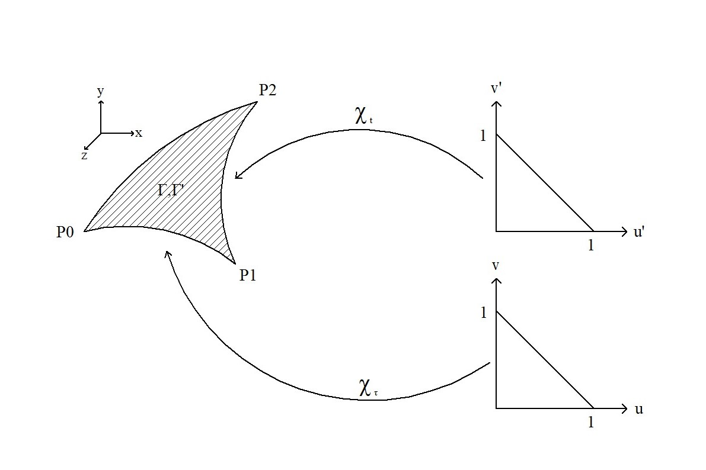
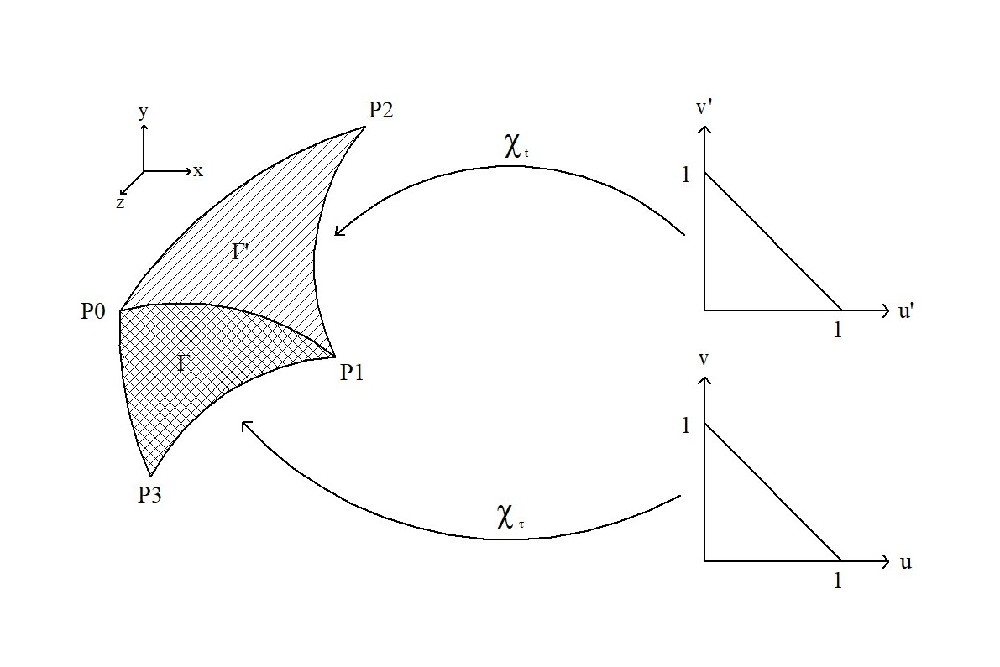
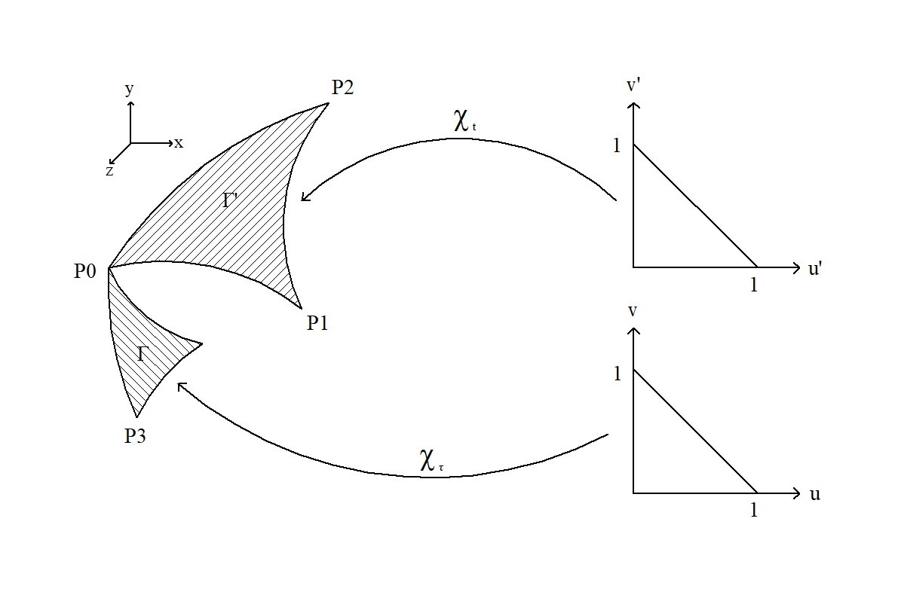
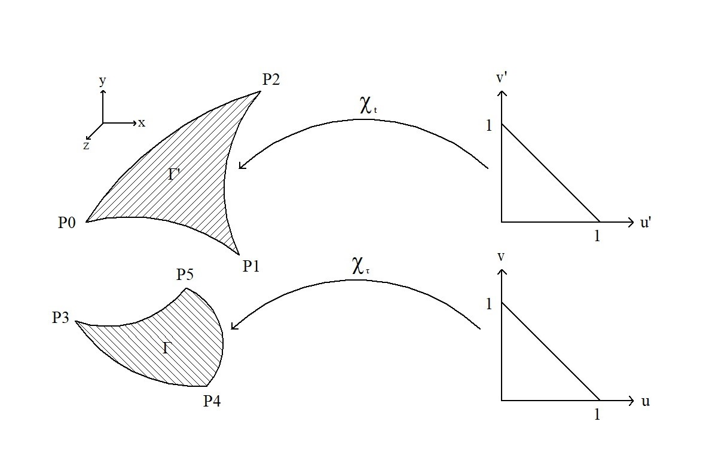

# Parameterized


The called function in this implementation looks like:

`sauterschwab_parameterized(sourcechart, testchart, integrand, method)`

As on the homepage already mentioned, the user has now to parameterize the integration areas by himself; that means that `integrand` is no more the original function which has to be integrated; `integrand` is now the parameterized version of the original integrand including the two surface elements of both charts.

Before the parameterizations/charts (parameterization = chart) are built, the user has to figure out, which integration method should be applied, and decide how accurate the integration shall be done. It is recommended that the user read the page 'Non-Parameterized' before he continues reading here because otherwise he may not be able to apply the concepts of 'integration method' and 'accuracy'.

The parameterization of the sourcetriangle will be called ``\chi_t``, and the parameterization of the testtriangle will be called ``\chi_\tau``. In the following, the parameterization of every single integration method will be presented.


## Common Face

``\Gamma`` and ``\Gamma'`` are equal, and both parameterizations must be equal as well: ``\chi_t(u',v') = \chi_\tau(u,v)``.



The user's task is to find a parameterization, which maps the reference triangle (right) on to the real triangle (left). The reference triangle is throughout this package always the same.

 That parameterization is a function, which corresponds to the input arguments `soucechart` and `testchart`.

The original integrand, which is a function of ``\textbf{x}`` and ``\textbf{y}``, becomes:

```math
f(\chi_\tau(u,v),\chi_t(u',v')) \cdot \|\frac{\partial \chi_\tau}{\partial u}\times\frac{\partial \chi_\tau}{\partial v}\| \cdot\|\frac{\partial \chi_t}{\partial u'}\times\frac{\partial \chi_t}{\partial v'}\|
```

 This function method as well as the following methods, transform the two area-integrals in parameters domain into four 1D integrals from zero to one, therefore the last argument can be created by

`cf = CommonFace(x)`.

`cf` is an object of type `CommonFace()`, x is the number of quadrature points on the integration path ``[0,1]``.

An example of this case can be found in the common_face_parameterized.jl file in the example folder.


## Common Edge

``\Gamma`` and ``\Gamma'`` have an edge in common, and both parameterizations must fulfill the condition ``\chi_t(s,0) = \chi_\tau(s,0)``. For example, this condition could be met if the points ``(u\in[0,1];0)`` and ``(u'\in[0,1];0)`` are mapped on the same point on the common edge.



The parameterizations are functions, which correspond to the input arguments `soucechart` and `testchart`.

The modified integrand looks like in the case Common Face.

The last argument can be created by

`ce = CommonEdge(x)`.

`ce` is an object of type `CommonEdge()`, x is the number of quadrature points on the integration path ``[0,1]``.

An example of this case can be found in the common_edge_parameterized.jl file in the example folder.


## Common Vertex

``\Gamma`` and ``\Gamma'`` have one vertex in common, and both parameterizations must fulfill the condition ``\chi_t(0,0) = \chi_\tau(0,0)``. This condition means that the origin of both reference triangles is mapped on the common vertex.



The parameterizations are functions, which correspond to the input arguments `soucechart` and `testchart`.

The modified integrand looks like in the case Common Face.

The last argument can be created by

`cv = CommonVertex(x)`.

`cv` is an object of type `CommonVertex()`, x is the number of quadrature points on the integration path ``[0,1]``.

An example of this case can be found in the common_vertex_parameterized.jl file in the example folder.


## Positive Distance

The two triangles do not touch at all, and both parameterizations need only to map from the reference triangle on to the real triangle.



The parameterizations are functions, which correspond to the input arguments `soucechart` and `testchart`.

The modified integrand looks like in the case Common Face.

The last argument can be created by

`pd = PositiveDistance(x)`.

`pd` is an object of type `PositiveDistance()`, x is the number of quadrature points on the integration path ``[0,1]``.

An example of this case can be found in the positive_distance_parameterized.jl file in the example folder.
